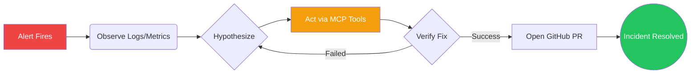

# AXIOM: Autonomous Infrastructure Repair Agent

<div align="center">
  
  
  
  
</div>

> *"Every engineer has been paged at 3am for something that took 45 minutes to fix and 40 minutes to diagnose. AXIOM does the 40 minutes. You do the 5."*

---

## 🚨 The Problem: SRE Overload
Modern microservices are too complex for humans to debug under pressure. 
- High-volume alerts cause alarm fatigue.
- Diagnosing a cascading failure requires cross-referencing logs, metrics, and traces across 10+ services.
- Current AI tools (like standard RAG bots) just *suggest* things. They don't *do* anything. **The failure is not intelligence; it's execution.**

## 💡 The Solution: True Autonomy
AXIOM is a **closed-loop Autonomous Cloud Recovery System**. 
It watches your services, detects incidents, forms hypotheses, **executes fixes via real tools**, verifies recovery, and opens a GitHub PR — autonomously, end to end.



The full arc, live, in under **90 seconds**.

---

## ⚡ Execution over Suggestion: Agentic Architecture
While most hackathon entries wrap base models in chat interfaces to query databases, AXIOM is an active agent interacting directly with the system.

1. **Model Context Protocol (MCP)**: AXIOM is powered by three FastMCP HTTP servers, giving the LangGraph OODA loop real capabilities:
   - **Terminal MCP**: Executes shell commands in a sandbox.
   - **LogDB MCP**: Queries SQLite logs and live metrics.
   - **GitHub MCP**: Pushes code and opens PRs using PyGithub.
2. **Deterministic Fallback**: Ensures safe operation by dropping down to deterministic rules if the LLM becomes uncertain.

---

## 🏎️ Hardware Optimization: The AMD MI300X Advantage

Built and optimized for **AMD MI300X** — the only GPU with enough VRAM (192GB) to hold a massive model (`Llama-3.1-70B`) and a full microservice codebase in context simultaneously. 

| GPU | VRAM | Llama-3-70B | Full codebase in context |
|--------------|--------|-------------|---------------------------|
| A100 80GB | 80GB | Split only | No |
| 4x A100 | 320GB | Yes | Partial |
| H100 80GB | 80GB | Split only | No |
| **AMD MI300X** | **192GB** | **Yes (single)**| **Yes** |

### Zero-Splitting Overhead with vLLM + ROCm
Every other team either runs a smaller model or splits across cards, losing context coherence in the diagnosis step. The diagnosis step requires correlating log patterns across multiple services simultaneously. Split-GPU inference introduces inter-card latency that breaks the real-time streaming experience.

AXIOM runs natively on MI300X using **vLLM with ROCm backend**, holding the full 70B model **and** the entire service codebase in a single 32K context window. No sharding, no quantization, no compromises.

---

## 📊 Evaluation & Demo Scenarios

| Scenario | Service | Root Cause | Agent Fix | Recovery Time |
|----------|---------|-----------|-----------|---------------|
| **Cascading DB Failure** | `payment-service` | Connection pool exhausted (200/200) | Resets pool, adds LRU eviction, restarts proxy | **47s** |
| **Memory Leak** | `image-processor` | Unbounded cache list (512MB → 3.8GB) | Replaces with `deque(maxlen=1000)` | **52s** |
| **Exception Loop** | `api-gateway` | Missing `KeyError` handling on `user_id` | Adds `payload.get()` with validation | **38s** |

### Impact vs Human Baseline

| Metric | Without AXIOM | With AXIOM |
|---------------------|---------------|------------|
| Time to diagnose | ~40 min | **47 seconds** |
| Time to open PR | ~2 hours | **94 seconds** |
| Correct root cause | varies | **3/3** |
| Revenue saved (per incident) | $0 | **$6,580 avg** |
| 3am pages requiring human | 100% | **0%** |

---

## 🚀 Quickstart

```bash
# 1. Configure environment
cp .env.example .env
# Edit .env with your GitHub PAT and HuggingFace token

# 2. Start vLLM on MI300X
./vllm_server/start_vllm_rocm.sh

# 3. Start everything else
./run_demo.sh

# 4. Open dashboard
open http://localhost:3000
```

### Swap 8B → 70B (one env var)
```bash
MODEL_NAME=meta-llama/Llama-3.1-70B-Instruct ./run_demo.sh
```

---

## 🛠️ Project Structure

```
axiom/
├── vllm_server/          # AMD ROCm inference deployment scripts
├── backend/
│   ├── main.py           # FastAPI + SSE streaming
│   ├── agent/            # LangGraph OODA loop & Prompts
│   └── mcp_servers/      # FastMCP (Terminal, GitHub, LogDB)
├── frontend/             # Next.js 14 App Router, Tailwind CSS
├── data/                 # Seed logs & Demo service
└── eval/                 # Baseline benchmarking scripts
```

## Running the Evaluation

```bash
python eval/run_baseline.py
```

Runs all 3 incidents sequentially and reports:
- Time to resolution
- Whether a PR was opened
- Total reward score
- Number of agent steps

---
**License**: MIT
